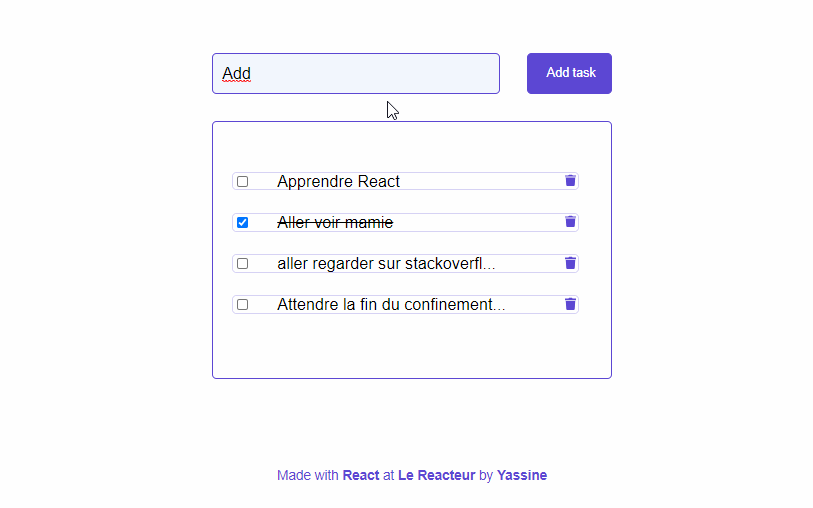

# React Todo List

This is a Todo list made with React to be able to visualise what you did and what you have to do.

## Installation

Just run `yarn` in your console to install all dependencies and `yarn start` to launch.

## Features

- Add task to the app.

- Mark task as done by using a checkbox.

- Delete a task from the app.

## Netlify link

[https://zmzm-todolist.netlify.app/]

